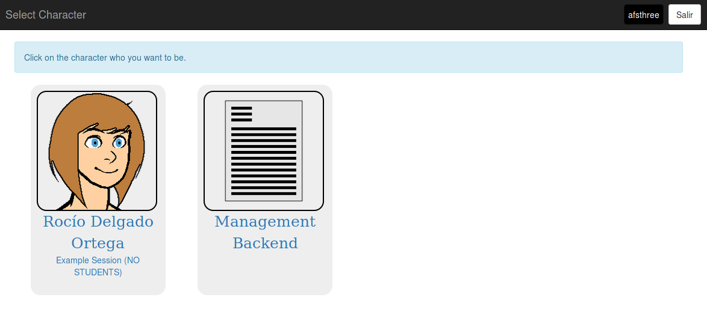
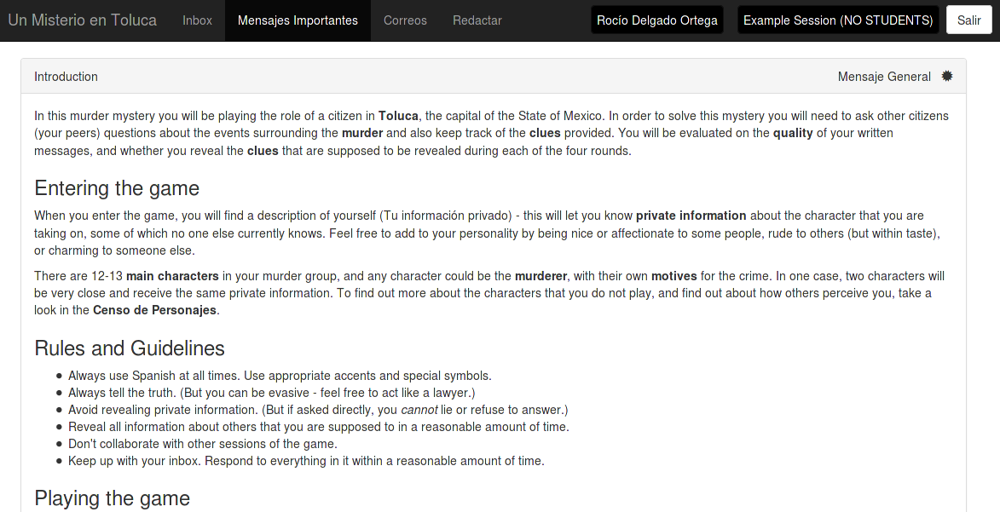
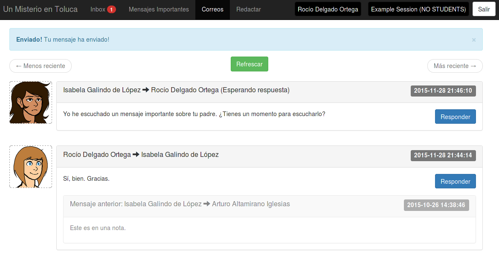
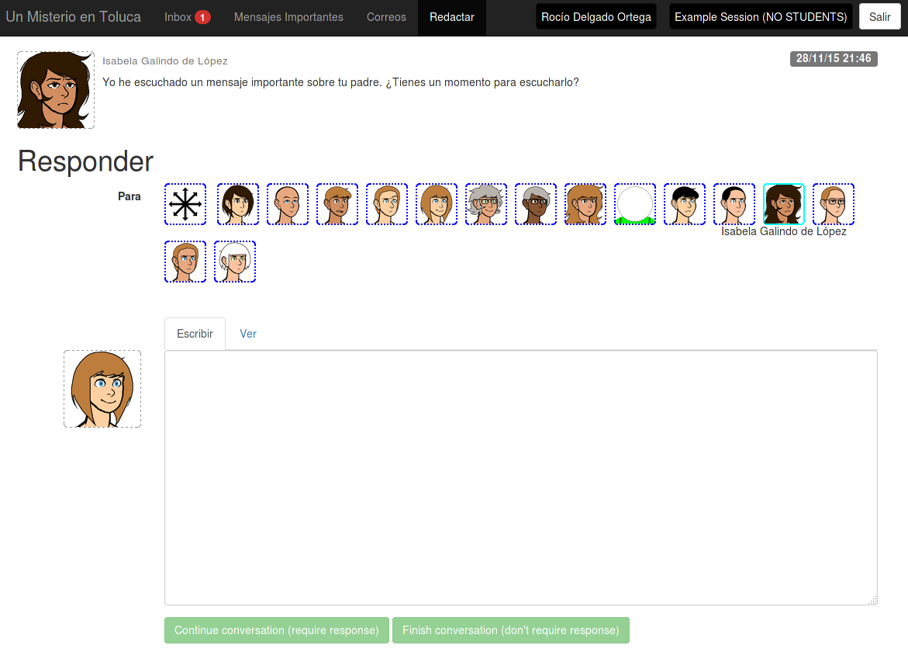
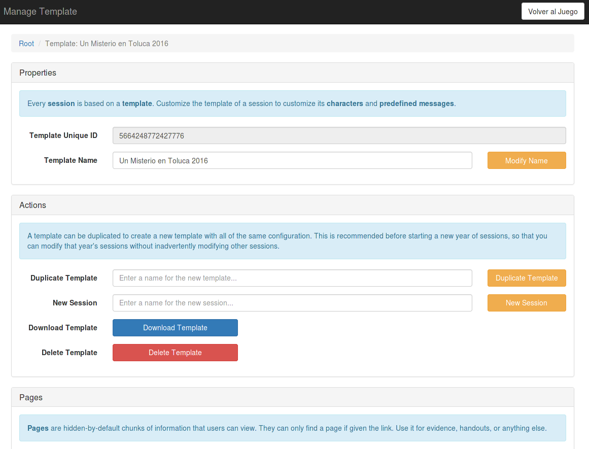

# Un Misterio

This is a roleplaying platform, designed for use with prestructured games used as a teaching aid in mid-level Spanish classes.

It has been used to run games of Un Misterio en Toluca in Catlin Gabel's Spanish III classes.

Although the platform is complete, it does not include any actual game plans - you will need to create or acquire your own game separately and import it yourself. This is for copyright reasons.

## Trying it out

There is currently a deployment of Un Misterio in use by the author, but it is not set up as a public site.

You will need to host your own deployment of the system. Luckily, you can do so very easily:

 * Create a new Google App Engine application. You can use the free tier for this.
 * Clone this repository with Git.
 * Change the application identifier in app.yaml to point to your new application.
 * Deploy this application to Google App Engine.
 * Log in to the application with your Google account and set up a game template!

## Google App Engine free tier

It is perfectly possible to run a deployment of this application at no cost.

According to load tests, it should be able to support four groups of around 12-13 players within the Google App Engine free tier limits. You will, however, want to do your own load tests and use the paid tier if the free tier will not support your load.

## Need help?

You can file a bug report here on GitHub.

# Screenshots

## Character selection

## Introductory message

## Playing the game

## Responding to messages

## Managing the game

